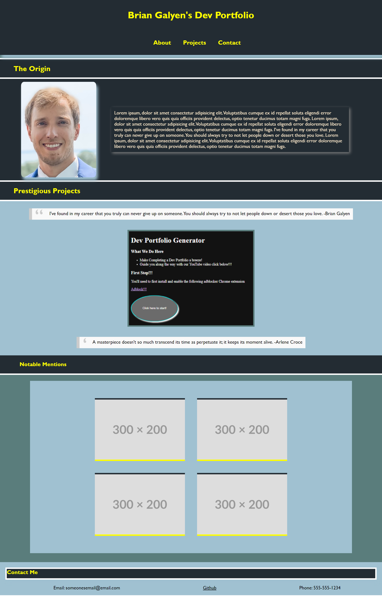

# Developer Portfolio

## Description

This challenge site contains the building blocks to a developer's portfolio, allowing for a one-stop landing spot for all of my various developer projects to show potential employers. Now, I will be able to share my work, without having to rush to compile my projects while searching for employment.

## Usage

Visit this URL: <https://seeyouthursday.github.io/C2-Developer-Portfolio>

To navigate this website, simply select a topic from the navigation bar at the top of the site. For example, selecting "About" will take you to "The Origin" section of the page with generic text to describe myself when I use this site in the future. In the Prestigious Project section, hover over each image to see this title of the dev project. Click anywhere on the images to navigate to the project. Contact info is available at the bottom of the site (selecting 'Contact' from the navbar or scroll). The first large image is my first deployed site. Enjoy!

## License

Please refer to the LICENSE in the repo.
